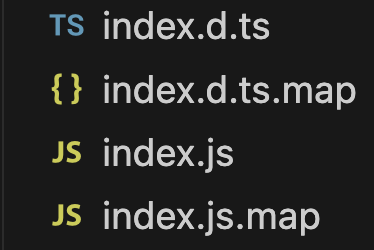
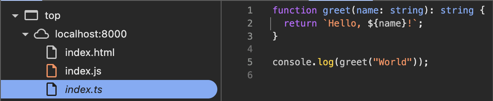
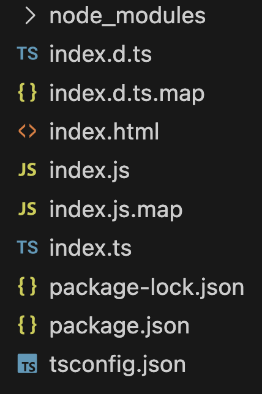
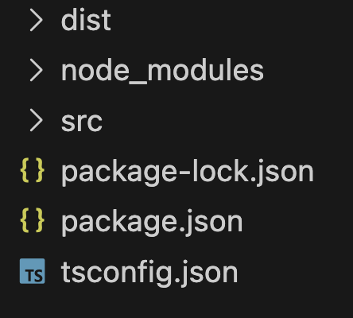
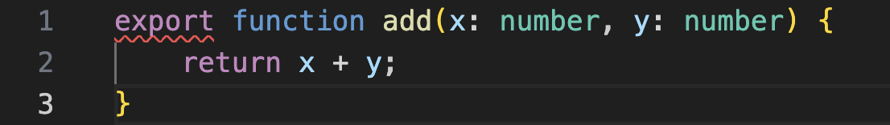
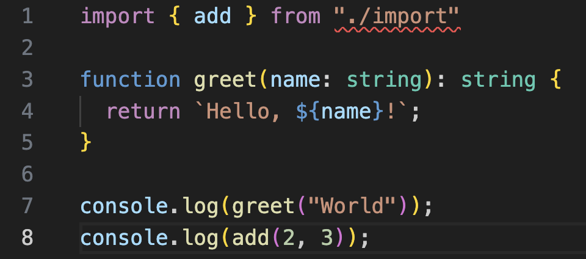
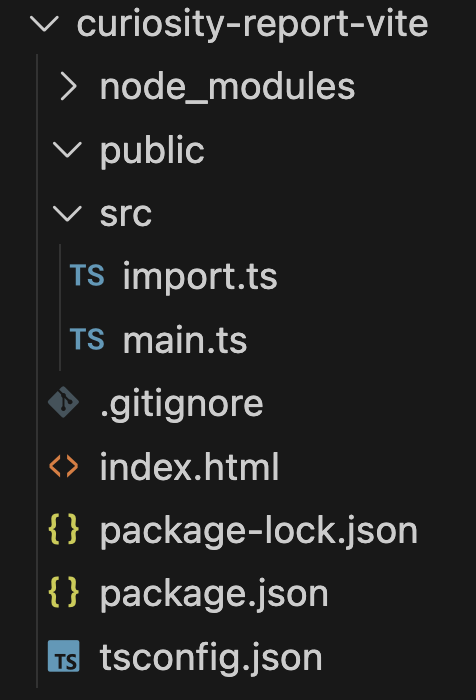
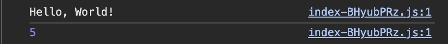

# The Modern TypeScript Environment From the Ground Up

## Introduction and Relevancy

With an ever increasing number of developers using TypeScript as their primary programming language, most of us simply want to set up the environment, have it function correctly, and move on with writing code. This typically takes the form of copying a few terminal commands from official documentation or a tutorial and moving on with life. Situations where environment setup becomes unworkable are common enough to fall under the umbrella of so-called "dependency hell." With JavaScript/TypeScript, the tooling surrounding environment management and configuration has actually become so sleek and reliable that many web developers simply no longer know our tools. The commands always work, and the config file incantations seem to play nice. When they don't, we vomit the logs into the nearest AI and pray it outputs a configuration which will play nice upon attempting to recompile.

As a DevOps or QA professional, understanding the building blocks of a modern typescript programming environment is essential to create reproducible build/deployment pipelines. Additionally, understanding these pieces can ensure all developers on a given team have the same type of environment when developing locally.

## The Pieces

With the myriad technologies existing in a web developers stack, a cutoff needs to be considered somewhere. We will begin with `npm` and end with bundlers such as `vite`. I will focus on development for the frontend (the browser), but I will make notes about the backend when relevant. Throughout the discussion, I may note broad historical trends, but discussing the minutia of the past isn't as important to me as understand the tools I'm currently using. Additionally, the information presented will be done in a matter-of-fact narrative. The vast majority of the information I did not know in advance of my research, but linking things together in a coherent narrative including information I previously recalled helps me structure my thinking.

Beginning with the end in mind, we can't forget that ultimately the code we write as web developers must be delivered to our user's browsers as plain, compatible JavaScript. The task of then interpreting that JavaScript to manipulate the end user's hardware is a herculean task with far fewer options. Indeed, browser engine diversity and potential monopolies are hotly debated today.

## Project Initialization

`npm init -y` is surely in the list for the top 10 verbatim commands ever run in a terminal. Whilst we will analyze the default output of this command soon, it's important to note that this command requires Node.js to be installed. Notably, Node.js has been highly influential on the direction of modern web development. Released in 2009 by creator Ryan Dahl, Node.js, and shortly after, npm gained fans on both the frontend and backend. It's fair to say that this period marks the beginning of the web development we're familiar with today—especially as libraries like jQuery fade into the past. With this tool, developers could write backend code in the same language they had mastered on the frontend. Additionally, package management was unified with a common tool. Interestingly Ryan is now pursuing a legal battle against Oracle for their trademark of the name JavaScript, and simultaneously developing another JavaScript runtime called Deno. Perhaps he, or another, will re-enchant the JavaScript landscape once more as some of the promises of JavaScript/TypeScript have left programmers wanting.

Returning to the output of the previous command, my machine outputs the following `package.json` file.

```JSON
{
  "name": "curiosity-report",
  "version": "1.0.0",
  "description": "",
  "main": "index.js",
  "scripts": {
    "test": "echo \"Error: no test specified\" && exit 1"
  },
  "keywords": [],
  "author": "",
  "license": "ISC",
  "type": "commonjs"
}

```

Most of these fields are self-explanatory. Though npm purports to be a package manager, the scripts field seems to enable it to act as a lightweight build system such as `make` for C. Encouragingly, the simplicity of this file even in the modern development scene shows how beautiful the tool is that Dahl created. The `package.json` file is utterly ubiquitous. No other language seems to have adopted such a strategy for dependency management so uniformly and overwhelmingly. Given its existence for a decade and a half at this point, we cannot attribute such massive adoption to lack of alternatives alone.

Given the file's unassuming nature, we might assume it contains sensible defaults for relatively opaque fields such as `type`. However, we will soon see this is not the case.

Adding `"start": "node index.js"` to the scripts portion of the file and a simple file yields the following output when run. It all begins simply, and for now the stack easily fits in our mind.

```JavaScript
// index.js

console.log("hello, world!");
```

```Console
% npm run start

> curiosity-report@1.0.0 start
> node index.js

hello, world!
```

## Introducing TypeScript

TypeScript was first published in 2012 by Microsoft. Anders Hejlsberg was one of the lead creators, and also the creator of C#. Rather than writing a browser engine which could interpret a different language or attempting to change JavaScript itself via bureaucratic means, Microsoft saw TypeScript as a way to improve developer experience and code quality with comparatively low effort and easy adoption in the existing market. There are no shortage of online forums extolling the virtues of the language. Indeed, modern web developers write TypeScript nearly as much by survey data than they do JavaScript (source:  https://2025.stateofdevs.com/en-US/technology/). Clearly adoption is growing, many people view it as the "modern" and "professional" option.

The documentation tells us to run `npm install typescript --save-dev` in our project to install it (source: https://www.typescriptlang.org/download/). To run it, they recommend `npx tsc`. This outputs a dizzying amount of options, but `tsc --init` looks like a sensible one. Additionally, after running `npx tsc index.ts` we get a JavaScript file output with the same name. Running that file with `npm run start` once more gives:

```TypeScript
// index.ts

function greet(name: string): string {
  return `Hello, ${name}!`;
}

console.log(greet("World"));

```

```JavaScript
// index.js

function greet(name) {
    return "Hello, ".concat(name, "!");
}
console.log(greet("World"));

```

```Console
% npm run start

> curiosity-report@1.0.0 start
> node index.js

Hello, World!
```

Surprisingly, we've done quite a bit of magic with just those few commands. At this point, we programmers are tempted to celebrate that we have a semi-functional environment and get on with life. However, understanding the nature of these commands is essential. In order of original mention:

- `npm install typescript --save-dev` installs typescript as a `devDependency` as declared in the new `package.json` lines:
    - ```JSON
          "devDependencies": {
            "typescript": "^5.9.3"
          }
        ```
        
    - These dependencies are those which are required for development but not required for the code to run.
- `npx tsc` or "Node Package Execute" looks for a local install of binaries under the `node_modules` folder which is created when the first dependency is installed. If a binary is found with a matching name, it is run. If one is not found, npx tries to find a global install. Finally, if that fails, npx will temporarily download the matching npm binary, execute it, and leave no artifacts other than those created by the binary. In our case a quick peek into `node_modules` reveals a `.bin` folder with `tsc` inside. 
- `tsc --init` creates a `tsconfig.json` file. Tsc itself stands for "TypeScript compiler". Really this "compiler" is technically a "transpiler" which translates TypeScript into valid JavaScript. Removing most of the commented-out settings, my machine produces the following file:
    - ```JSON
        {
          "compilerOptions": {
            // File Layout
            // "rootDir": "./src",
            // "outDir": "./dist",
        
            // Environment Settings
            "module": "nodenext",
            "target": "esnext",
            "types": [],
        
            // Other Outputs
            "sourceMap": true,
            "declaration": true,
            "declarationMap": true,
            
            ...
          }
        }
        
        ```
        
    - In my opinion, this is the point at which developers completely cease understanding how their project is operating or with what configuration options their end code is being compiled with. Indeed, trying to understand each of these options (let alone other available ones) seems like a rabbit hole not worth following unless one gets exceptionally curious.
- `npx tsc index.ts` simply compiles a lone TypeScript files. It should be noted that this bypasses the `tsconfig.json`. 

## Breaking Down TSConfig

Prior to breaking down the options in `tsconfig.json`, we ought to run it with the default options and see what is outputted. Running `npx tsc` outputs the following files:



In order, these files consist of

- `index.d.ts` allows users who import your compiled code to retain type safety. Compiled TypeScript is just JavaScript, so this is necessary when publishing packages which are essentially always downloaded as the compiled version with these files for typing.
- `index.d.ts.map` is used to map `index.d.ts` to the original TypeScript file before compilation. This ensures features in IDE's such as "go to definition" work properly if the user has the source.
- `index.js` is the compiled code that ultimately runs in the browser.
- `index.js.map` is requested by the developer tools in the browser such that if the original typescript file is also available and requested, breakpoints can be set in that file as well.. For instance running `python3 -m http.server` and visiting `http://localhost:8000/index.html` (a simple file that just includes `index.js` as a script tag) and visiting the developer tools reveals that the TypeScript file was requested and the mapping was created such that we can set breakpoints at will.
    - 

### File Layout

At this point, our project directory is highly polluted. The TSConfig allows us to set a source and distribution directory to clean this up. We uncomment the `rootDir` and `outDir` lines in the config to accomplish this after creating the appropriate folders.





### Environment Settings

Firstly, `target` is used to determine what version of JavaScript is outputted. `type` is used to determine what type declarations are valid (i.e `node`, etc). 

More interestingly, `module` tells us what type of import style will be created in the compiled JavaScript. The default value is `nodenext`, but we'll see that this presents some issues. A quick google search shows that using "ES Modules" is the modern approach for best performance and static analysis. Thus, a naive user might try to export the following function. Rather surprisingly, by writing a singular export we've already broken our development environment and our project is no longer compiling.



The tooltip gives the following information.

```Text
A top-level 'export' modifier cannot be used on value declarations in a CommonJS module when 'verbatimModuleSyntax' is enabled.
```

At this crossroad, it seems that disabling the mentioned setting in `tsconfig.json` is the solution. Shockingly, if we were to do this, we will have been fooled into allowing CommonJs-style imports into our compiled code! All of a sudden, if our code is server to a browser, it will not run! Browsers can only interpret ES Module syntax, and as such, sensible defaults for npm and TypeScript have come back to bite us. Reversing our hasty decision we actually have two other primary options which will resolve the issue.

The `"module": "nodenext"` default causes TypeScript to follow the Node.js convention of respecting the module type in `package.json`. By changing that line to `"type": "module"`, we resolve our export  issues. However, when trying to import our newly created function, we get another lint error!



```Text
Relative import paths need explicit file extensions in ECMAScript imports when '--moduleResolution' is 'node16' or 'nodenext'. Did you mean './import.js'?ts(2835)
```

At this point, I believe most developers are inclined to throw in the towel. Most of us would be absolutely fed up with configuring the environment to allow even basic functionality to work properly. Additionally, the hint tells us to consider adding a ".js" extension. Since we're writing in TypeScript, this seems especially odd. This error comes from having `"module": "nodenext"` set. Node import rules require a file extension, but changing this to `"module": "esnext"` resolves the error. This conflict between Node and TypeScript is still unresolved, and has frustrated several developers (source: https://stackoverflow.com/questions/75807785/why-do-i-need-to-include-js-extension-in-typescript-import-for-custom-module). Ultimately, despite compiling, this solution won't allow our code to run in the browser. TypeScript will not add file extensions, so really our only option is to add a ".js" extension to the end of each of our imports in anticipation of the compiled version of the module.

## Bundlers

In this environment, bundlers have been provided as a solution to this issue. Extension-less imports are considered more modern and flexible. Also, the ts/js mismatch is confusing and difficult to remember. Their main purpose is to bundle all assets for distribution to the end user. Previously, we would have needed to collect all the right files ourselves and combined them with HTML and CSS files for distribution. Additionally, they have the ability to rewrite imports to target whatever environment the developer requires. One popular frontend build tool, `Vite`, also includes a development server with hot module replacement (source: https://vite.dev/guide/). Instead of running `npm init -y` and `tsc --init`, developers merely run `npm create vite@latest`, and out pops a properly configured project.



The project is remarkably similar to our previous one, with some added conveniences. For example, `package.json` includes a build script: `"build": "tsc && vite build"`. Running this and then serving it using the python server once more shows the output returning. Vite has solved our runtime issues with modules and rewritten the import or optimized it out altogether into a singular file.



Thus, Vite has taken over the responsibility of resolving modules and transpiling. In other words, the "TypeScript compiler" is now only a type checker. Moving around complexity like this can be hard to parse, but ultimately, understanding it even from a high level is rewarding and can lead to quicker debugging on difficult dependency-related issues.